# 多城市共享单车天气研究

本项目用多城市数据研究共享单车日使用量与通用热气候指数（UTCI）、降水量之间的关系。主分析覆盖 25 个城市、9,120 个城市日；原始数据范围为 29 个城市。项目采用层级贝叶斯模型，期中已完成数据处理、探索性分析、报告和演示。

研究背景、数据来源、数据字典、模型方案、既有结果、交付说明和运行命令统一收录在 [`docs/project-reference.md`](docs/project-reference.md)。这是项目的详细说明文档。

## 文件夹结构

```mermaid
flowchart TD
    project["midterm/"]
    project --> readmeFile["README.md"]
    project --> ignoreFile[".gitignore"]
    project --> requirementsFile["requirements.txt"]
    project --> codeDir["code/"]
    codeDir --> prepareScript["prepare_bikeshare_weather.py"]
    codeDir --> edaScript["eda_midterm.py"]
    codeDir --> modelScript["fit_pilot_model.py"]
    codeDir --> pilotRunner["run_pilot_model.sh"]
    codeDir --> buildScript["build_midterm.sh"]
    project --> dataDir["data/"]
    dataDir --> cleanPanel["clean/bikeshare_weather_daily.csv"]
    dataDir --> rawDir["raw/"]
    rawDir --> sourceArchive["bikeshare_weather_40cities.zip"]
    rawDir --> sourceTables["bikeshare-weather-40cities/"]
    sourceTables --> bikeData["bs/bs-ll.csv and stock-data.csv"]
    sourceTables --> weatherData["utci/f_rain.csv and f_utci.csv"]
    project --> projectDocs["docs/project-reference.md"]
    project --> figuresDir["figures/ (12 PDF and PNG pairs)"]
    project --> reportDir["report/"]
    reportDir --> reportSource["midterm_report.tex"]
    reportDir --> reportPDF["midterm_report.pdf"]
    reportDir --> bibliography["references.bib"]
    reportDir --> reportStyle["neurips_2026.sty"]
    project --> resultsDir["results/"]
    resultsDir --> auditJSON["bikeshare_weather_data_audit.json"]
    resultsDir --> edaJSON["eda_midterm.json"]
    resultsDir --> modelDir["model/"]
    modelDir --> diagnostics["pilot_diagnostics.json"]
    modelDir --> modelSamples["pilot_model.nc"]
    project --> slidesDir["slides/"]
    slidesDir --> slidesSource["midterm_slides.tex"]
    slidesDir --> slidesPDF["midterm_slides.pdf"]
    slidesDir --> slidesTheme["beamerthemeCuhksz.sty"]
    slidesDir --> assetsDir["assets/"]
    assetsDir --> crest["cuhksz_logo_alt.png"]
    assetsDir --> wordmark["cuhksz_wordmark.png"]
```



## 文件用途

### 项目根目录

| 文件 | 用途 |
|---|---|
| `.gitignore` | 忽略 `.DS_Store`、`.venv/`、`.package/`、Python 缓存文件、`report/build/` 和 `slides/build/`。 |
| `requirements.txt` | 固定 ArviZ、matplotlib、netCDF4、NumPy、nutpie、pandas 和 PyMC 版本。 |
| `README.md` | 项目入口、架构图、文件说明和快速运行命令。 |

### `code/`

| 文件 | 用途 |
|---|---|
| `prepare_bikeshare_weather.py` | 核验原始数据并生成日度 CSV 与数据审计 JSON。 |
| `eda_midterm.py` | 生成探索性结果 JSON，以及报告和补充图表。 |
| `fit_pilot_model.py` | 拟合层级 Student-t 模型并写出短链诊断和 NetCDF 样本。 |
| `run_pilot_model.sh` | 设置 PyTensor 运行参数，再启动 `fit_pilot_model.py`。 |
| `build_midterm.sh` | 重建探索性分析、报告和幻灯片。编译文件写入各自的 `build/` 目录。 |

### `data/` 与 `docs/`

| 路径 | 用途 |
|---|---|
| `data/raw/bikeshare_weather_40cities.zip` | Mendeley Data Version 1 原始数据包，许可为 CC BY 4.0。 |
| `data/raw/bikeshare-weather-40cities/bs/bs-ll.csv` | 城市名称、国家、气候代码、经纬度及时区。 |
| `data/raw/bikeshare-weather-40cities/bs/stock-data.csv` | 源数据中的小时共享单车使用量。 |
| `data/raw/bikeshare-weather-40cities/utci/f_utci.csv` | 源数据中的小时 UTCI。 |
| `data/raw/bikeshare-weather-40cities/utci/f_rain.csv` | 源数据中的小时降水量。 |
| `data/clean/bikeshare_weather_daily.csv` | 29 个城市的日度分析数据，10,578 行、28 列。 |
| `docs/project-reference.md` | 唯一的详细文档，收录研究、来源、数据字典、质量规则、模型、结果、交付与运行说明。 |
| 核心论文 | Bean、Pojani 和 Corcoran（2021），DOI：[10.1016/j.jtrangeo.2021.103155](https://doi.org/10.1016/j.jtrangeo.2021.103155)。 |
| 数据集 | Bean、Pojani 和 Corcoran（2021），Mendeley Data Version 1，DOI：10.17632/2nxpvtz935.1，CC BY 4.0。 |

### `figures/`

每个下列图名均有 PDF 和 PNG 两种文件。PDF 用于报告排版；PNG 为 300 dpi。报告使用 3 张图，幻灯片使用 5 张图。

| 图名 | 内容 |
|---|---|
| `report_fig1_data_overview` | 数据范围与研究样本概览。 |
| `report_fig2_weather_usage` | 天气和使用量的主要关系。 |
| `report_fig3_seasonality` | 日使用量的季节变化。 |
| `figS1_usage_distribution` | 使用量分布。 |
| `figS2_weather_distribution` | UTCI 与降水分布。 |
| `figS3_city_climate` | 城市与气候分组。 |
| `figS4_utci_curves_grid` | 各城市 UTCI 响应曲线网格。 |
| `figS5_rain_curves_grid` | 各城市降水响应曲线网格。 |
| `figS6_climate_group` | 气候组结果。 |
| `figS7_utci_anomaly_curve` | 城市内 UTCI 异常值响应曲线。 |
| `figS8_utci_curves_selected` | 代表城市 UTCI 响应曲线。 |
| `figS9_rain_curves_selected` | 代表城市降水响应曲线。 |

### `report/`

| 文件或目录 | 用途 |
|---|---|
| `midterm_report.tex` | 期中报告 LaTeX 源文件。 |
| `midterm_report.pdf` | 编译后的期中报告。 |
| `references.bib` | 报告参考文献数据库。 |
| `neurips_2026.sty` | NeurIPS 2026 LaTeX 样式文件。 |
| `build/` | 编译生成的辅助文件：`.aux`、`.bbl`、`.blg`、`.log`、`.out` 和 `midterm_report.pdf`。 |

### `results/`

| 文件或目录 | 用途 |
|---|---|
| `bikeshare_weather_data_audit.json` | 输入校验和、逐城统计、处理规则和输出校验和。 |
| `eda_midterm.json` | 探索性分析样本、温度、降水、季节和周末结果。 |
| `model/pilot_diagnostics.json` | 短链采样设置和收敛诊断。 |
| `model/pilot_model.nc` | 短链后验样本的 NetCDF 文件。 |

### `slides/`

| 文件或目录 | 用途 |
|---|---|
| `midterm_slides.tex` | 期中演示 LaTeX 源文件。 |
| `midterm_slides.pdf` | 13 页期中演示。 |
| `beamerthemeCuhksz.sty` | Beamer 主题和页面样式。 |
| `assets/cuhksz_logo_alt.png` | 演示封面使用的校徽图像。 |
| `assets/cuhksz_wordmark.png` | 演示封面使用的双语校名图像。 |
| `build/` | 编译生成的 PDF 和 `.aux`、`.log`、`.nav`、`.out`、`.snm`、`.toc` 文件。 |
| `midterm_slides.aux`、`midterm_slides.log`、`midterm_slides.nav`、`midterm_slides.out`、`midterm_slides.snm`、`midterm_slides.synctex.gz`、`midterm_slides.toc` | 幻灯片根目录中的 LaTeX 编译辅助文件。 |

`.venv/` 是本地 Python 环境，已列入忽略规则。报告和幻灯片的编译辅助文件保存在各自的 `build/` 目录中。

## 快速运行

创建 Python 3.12 环境并安装依赖：

```bash
uv venv --python 3.12 .venv
uv pip install --python .venv/bin/python -r requirements.txt
```

生成日度数据和探索性分析结果：

```bash
.venv/bin/python code/prepare_bikeshare_weather.py
.venv/bin/python code/eda_midterm.py
```

重建期中材料：

```bash
./code/build_midterm.sh
```
